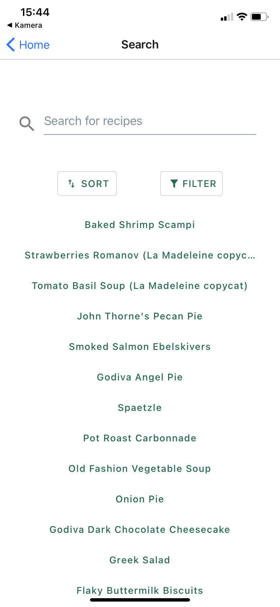
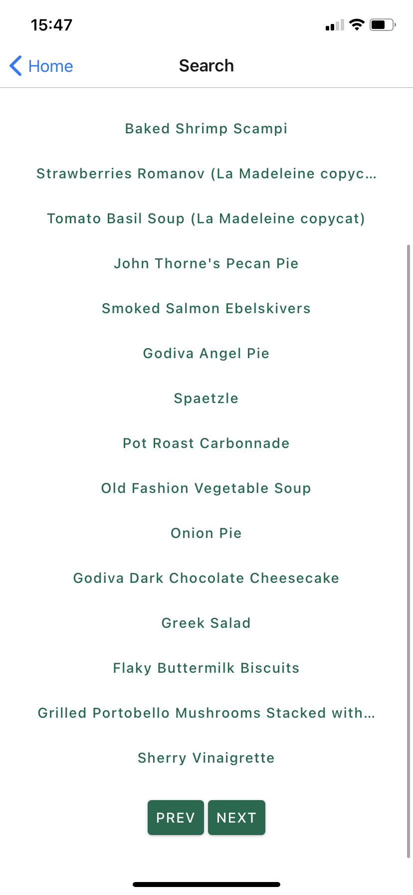
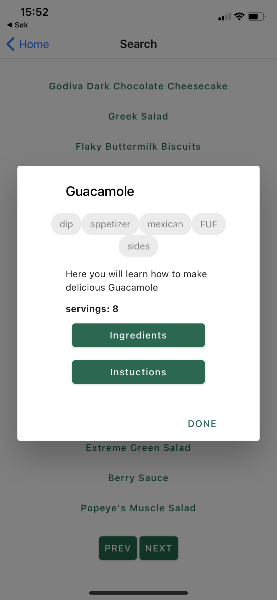
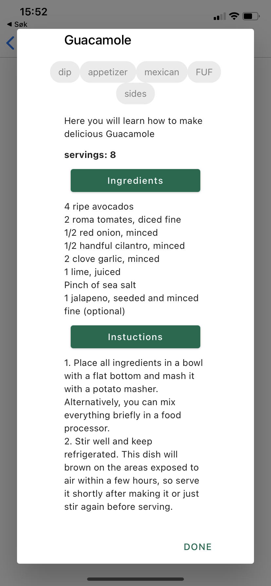

# Mobilapplikasjon for Bon Appétit - IT2810 Prosjekt 4

Vi har valgt å utvikle en mobilapplikasjon som bygger videre på webapplikasjonen vi utviklet i prosjekt 3. Mobilapplikasjonen gir mulighet til å søke blant hundrevis av oppskrifter, samt filtrere og sortere søkeresultatene. 

### På appen kan brukeren:
- Se oppskrifter i en liste
- Søke blant oppsrifter
- Filtrere på type
- Sortere på alfabetisk rekkefølge og på antall porsjoner fra flest til færrest.

   

## Hvordan kjøre prosjektet
For å kjøre appen på mobil må først appen [Expo](https://expo.io/tools#client) lastes ned.

Klon prosjektet og kjør deretter følgende kommandoer i terminalen :  
- `npm install expo-cli --global`  
- `expo start`  

Scan QR-koden som dukker opp i terminalen eller i Expo developer-fanen i nettleseren med mobilen. 

## Oppsett av prosjektet

### Prosjektets struktur
- `components/Frontpage` inneholder all funksjonalitet for applikasjonens startside
- `components/SearchBar.tsx` inneholder funksjonalitet for søking i datasettet
- `components/FilterBar.tsx` inneholder funksjonalitet for å filtrere søkeresultatet basert på tags
- `components/SortBar.tsx` inneholder funksjonalitet for å sortere søkeresultatet basert på antall porsjoner eller alfabetisk rekkefølge, både stigende og synkende
- `components/Modal.tsx` lager dialogboks med all informasjonen for hver enkelt oppskrift
- `components/RecipeDisplay.tsx` importerer og kaller informasjonen fra Mondal.tsx
- `components/RecipeContainer.tsx` samler komponentene SearchBar, SortBar, FilterBar og RecipeDisplay
- `components/Routes.tsx` tar inn RecipeContainer og Frontpage, og binder dermed all funksjonalitet i applikasjonen
- `App.tsx` tar inn Routes-komponenten

Mappen `store` inneholder all kode tilknyttet Redux. Se under punktet 'Redux' for å lese mer om bakgrunnen for valg av denne state manageren. Mer detaljert er koden fordelt slik: 

Alle Redux-komponentene ligger i mappen `store`.
-  `store/types/types.ts` inneholder de ulike handlingene som kan utføres. Dette er henholdvis handlinger tilknyttet søk, filtrering og sortering av datasettet. Ved hjelp av Redux kan vi enkelt sende nåværende tilstand rundt i applikasjonen, og igjen hente dette ut på serversiden. 

-  `store/actions/actions.ts` inneholder funksjoner for de ulike handlingene en applikasjonen støtter, altså _hva_ som endrer seg.

-  `store/reducer/index.ts` kombinerer reducers

-  `store/reducer/appReducer.ts` spesifiserer _hvordan_ applikasjonens state endrer seg i henhold til spesifikke handlinger (actions).

-  `store/store.ts` holder kontroll på nåværende state, og gjør at man kan oppdatere state eller hente state fra andre steder i applikasjonen.

## Teknologi og tredjepartskomponenter
### React og React Native
Prosjektet er som nevnt oppsatt med React Native som er et åpent kildekoderammeverk som enkelt lar en utvikle mobilapplikasjoner for utallige plattformer. Gruppen har gjennom arbeid med prosjektet tilegnet seg grunnleggende kunnskap om React Native ved å primært benytte seg av deres egen dokumentasjon, som finnes [her](https://reactnative.dev/docs/getting-started). 

### React Native Paper
Når det gjelder oppsett av prosjektets design og utforming har vi valgt å benytte oss av [Ract Native Paper](https://callstack.github.io/react-native-paper/). Dette er en tredjepartskomponent som tilbyr en rekke komponenter for å enkelt sette opp en mobilapplikasjon med de funksjonalitetene man måtte ønske. Ingen av gruppemedlemmene hadde erfaring fra utvikling av mobilapplikasjoner fra før, så valget falt på en tredjepartskomponent som var forholdsvis grei å sette seg inn i, samt hadde en dokumentasjon som man enkelt kunne følge. 

### Redux
For tilstandshåndtering har vi valgt å implementere prosjektet med Redux. Dette er hensiktsmessig siden applikasjonen skal støtte ulike former for brukerinteraksjon, samt at vi har valgt å dele applikasjonen inn i mange ulike komponenter. Applikasjonen inneholder mange datasett som endres seg fortløpende som følger av brukerinteraksjonen, og vi så det derfor hensiktsmessig å benytte oss av Redux. 

Ved bruk av en state manager som Redux er det enkelt å håndtere forandringer av tilstand på de ulike datasettene, og sende dette rundt i applikasjonen til de komponentene som har bruk for informasjonen til enhver tid.

## Backend
Siden vi valgte å bevare funksjonaliteten fra prosjekt 3, trengte vi heller ikke å gjøre store endringer i backend. Vi har derfor denne gangen valgt å koble opp backenden fra prosjekt 3 på den virituelle maskinen hvor vi tidligere kun hadde databasen. Dette krevde kun små endringer i server-filen i backend, og en annen url for fetching av data. 

Ved a benytte oss av unix-kommandoen `nohup node server.js&` har vi nå en backend som "kjører evig" på serveren, og derfor inneholder dette prosjektet-repoet ingen backendfiler.

## Gjenbruk
All funksjonaliteten vi ønsket å ha i applikasjonen hadde vi allerede utviklet for webapplikasjonen i prosjekt 3. Mesteparten av arbeidet har derfor bestått i å overføre dette til React Native. All kode for å håndtere endringer av state (gjort med Redux) er derfor gjenbrukt fra prosjekt 3. Dette gjelder da backend, funksjonalitet for søk, sortering og filtrering. 

Der det har vært en utfordring å tilpasse designet slik vi ønsker, samtidig som man tar vare på applikasjonens funksjonalitet, har vi prioritert å bevare funksjonalitet. Dette gjelder primært funksjonaliteten for å filtrere på kategorier. Her ønsket vi å gjøre designet likt som for sortering, men opplevde det da som en utfordring å bevare støtten få å velge flere filtre samtidig. Det ble derfor besluttet å beholde den løsningen vi har nå, hvor brukeren får mulighet til å velge flere filtre, slik oppgaven etterspør. 

## Testing
Applikasjonen er manuelt ende-til-ende testet kontinuerlig under utvikling. Dette er gjort for å ikke overse åpenbare tekniske feil som hadde gjort at applikasjonen ikke hadde fungert som ønsket. Dette er gjort ved å bruke Expo's utivklingsverktøy for mobil ved å bruke deres mobilapplikasjon (Expo client app) for å få tilgang til applikasjonen som kjører på localhost på datamaskinen.  

## Samarbeid, kommunikasjon og bruk av Git
Alle tre gruppemedlemmene har bidratt til prosjektet. Arbeidsoppgaven er fordelt ved å opprette issues i GitLab, for å deretter opprette branches til hvert enkelt issue. Her har vi fordelt issues i mellom oss, slik at vi var sikre på at alle arbeidsoppgaver ble utført i tide. 

### Videre utvikling
Like før innlevering oppdaget vi et par feilmeldinger i applikasjonen. Midt oppi skolearbeid og eksamensstress så vi oss nødt til å la disse feilmeldingene ligge for denne gang. Ettersom feilmeldingene kun er warnings, og ikke errors, og heller ikke går utover funksjonaliteten i appen tok vi da en avgjørelse på at det ikke var kritisk at feilmeldingene ble værende. Dette er selvsagt noe som kan fikses i en senere anledning dersom vi ønsker å jobbe mer med prosjektet.